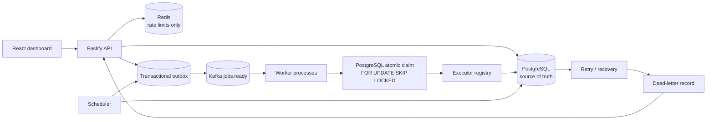

# Architecture

PostgreSQL is the authoritative source of truth. Redis is used for ephemeral rate limiting, Kafka is
transport, and the dashboard reads authenticated API projections.

## Runtime flow

1. The API validates and persists a job and its `JOB_READY` outbox event in one transaction.
2. The scheduler publishes pending outbox events to Kafka with bounded batches.
3. A worker atomically claims eligible jobs using PostgreSQL row locks and `SKIP LOCKED`.
4. The worker creates an execution record, runs an executor outside the claim transaction, then persists
   status, bounded output, and logs.
5. Retryable failures become `RETRYING`; exhausted or non-retryable failures create one DLQ record.
6. Expired leases become `ABANDONED` and are recovered by another worker.
7. The dashboard polls API projections; it never treats Redis or Kafka as authoritative state.

## Security boundaries

SMTP credentials remain in worker environment variables. Uploaded scripts are stored as payload data
and are not executed. A production script executor requires a separate sandbox/container boundary.
