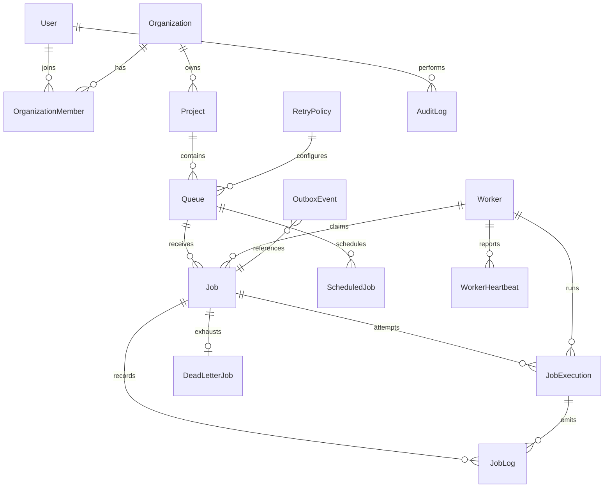

# Database Design

Phase 1 defines the PostgreSQL relational model for the Distributed Job Scheduler. PostgreSQL is
the system of record for users, organizations, projects, queues, schedules, jobs, attempts,
workers, logs, and dead-letter records. Redis and Kafka may support later runtime coordination or
event delivery, but they do not own durable scheduler state.

## Entities and Relationships

- `User` stores account identity and password hashes only, never plaintext passwords.
- `Organization` groups users and projects.
- `OrganizationMember` joins users to organizations with `OWNER`, `ADMIN`, or `MEMBER` roles and
  prevents duplicate membership per organization.
- `Project` belongs to one organization and uses `deletedAt` for soft deletion.
- `Queue` belongs to one project, may reference a retry policy, and uses `deletedAt` for soft
  deletion.
- `RetryPolicy` stores retry configuration, not calculated retry timestamps.
- `Job` is the concrete unit of work. It stores payload JSONB, lifecycle timestamps, current worker
  assignment, idempotency key, and lease expiration for later atomic claiming.
- `JobExecution` records each individual attempt and preserves attempt history with
  `UNIQUE(jobId, attempt)`.
- `JobLog` stores job and optional execution log lines. It complements execution history rather
  than replacing it.
- `ScheduledJob` stores recurring schedule definitions and next/last run timestamps. It does not
  pre-create infinite future jobs.
- `Worker` stores unique worker process identity and current lifecycle state.
- `WorkerHeartbeat` stores heartbeat history. Retention can be added later for high-volume
  deployments.
- `DeadLetterJob` stores one persistent dead-letter record per terminal failed job.

## Development Seed

The seed creates one development organization, owner, project, two queues, and two retry policies.
Set `SEED_OWNER_EMAIL`, `SEED_OWNER_NAME`, and `SEED_OWNER_PASSWORD_HASH` to override its defaults.
The fallback password value is an explicit development-only placeholder hash and is not a usable
plaintext password; production authentication must provide a real password hash through the
application's password-hashing flow.

## Constraints

Primary keys are UUIDs. The schema uses foreign keys for all relationships and unique constraints
for user email, worker identity, queue name within a project, membership per organization, one
dead-letter row per job, and one execution row per job attempt.

PostgreSQL check constraints enforce positive or non-negative numeric values where Prisma does not
express checks directly: queue priority, queue concurrency limit, retry delays and attempts, job
priority, job attempts, execution attempt and duration, and dead-letter attempt count.

## Important Indexes

- `jobs(queue_id, status, priority, created_at)` supports future queue polling and worker claim
  ordering.
- `jobs(status, scheduled_at)` supports promotion of scheduled and delayed jobs.
- `jobs(worker_id)` and `jobs(lease_expires_at)` support worker assignment and lease recovery.
- `job_executions(job_id, created_at)` and `job_executions(worker_id, created_at)` support job
  detail pages and worker history.
- `job_logs(job_id, created_at)` and `job_logs(execution_id, created_at)` support chronological log
  reads.
- `worker_heartbeats(worker_id, recorded_at)` supports worker health inspection.
- `scheduled_jobs(enabled, next_run_at)` supports scheduler scans for due recurring definitions.

## Deletion Behavior

Destructive parent deletes are restricted where historical data must remain. Projects and queues use
soft deletion so old jobs, executions, logs, and dead-letter records keep their context. Worker
references on jobs and executions use `SET NULL` so removing a worker record later does not destroy
execution history. Retry policy deletion sets queue references to null because the historical jobs
already store their own `maxAttempts`.

## Worker Claiming Considerations

Later phases can implement atomic claiming with PostgreSQL transactions using candidate indexes on
queue, status, priority, creation time, schedule time, and lease expiration. The schema keeps
`claimedAt`, `workerId`, and `leaseExpiresAt` on `Job` so a future claim query can lock eligible
rows and update assignment in one transaction.

## Retention and Partitioning

`JobExecution`, `JobLog`, and `WorkerHeartbeat` can grow quickly. Phase 1 keeps the model simple and
queryable. Later production work can add retention policies or partitioning by time and project
without changing the core entity boundaries.

## Entity Relationship Diagram

