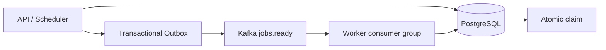

# Event-Driven Architecture

Phase 8 adds Kafka as transport and Redis as optional ephemeral coordination. PostgreSQL remains
authoritative for jobs, queues, execution history, retry state, DLQ state, ownership, and schedules.



## Events and Topics

The initial event is compact `JOB_READY` JSON containing `eventId`, `eventType`, `jobId`, `queueId`,
and `createdAt`. It contains no payload. The application uses `jobs.ready` for runnable-job hints;
`jobs.retry`, `jobs.events`, and `jobs.dlq` remain reserved until those event producers are needed.
There is no topic per queue. Kafka partitioning and retention are deployment configuration; consumers
use the `distributed-job-workers` group so workers share partitions and rebalance as instances scale.

Kafka delivery is at-least-once. A duplicate event is harmless because the worker loads the job from
PostgreSQL and performs the existing atomic claim before execution. Kafka offsets are acknowledged
only after the consumer has passed the event to the worker polling path; the database claim remains
the correctness boundary during rebalances.

## Transactional Outbox

`OutboxEvent` stores event type, aggregate identity, compact payload, attempts, error, and publication
timestamps. Domain changes and outbox rows are committed in the same PostgreSQL transaction. The
publisher scans bounded unpublished rows, reserves/publishes them without holding a database
transaction open during Kafka I/O, and marks them published afterward. Kafka and PostgreSQL cannot
be made atomically committed with a normal transaction, so duplicate publication is accepted and
consumers must be idempotent.

If Kafka is unavailable, the domain transaction still succeeds and the outbox row remains durable for
later publication. Kafka transport failures do not create application retry attempts.

## Redis

Redis is used only for optional API rate limiting. The current policy is configurable through
`API_RATE_LIMIT_PER_MINUTE` and fails open when Redis is unavailable because rate limiting is not a
security or job-correctness boundary in this phase. Jobs, execution state, retries, and DLQ records
continue to work from PostgreSQL after a Redis restart. Authoritative job caching is intentionally
not introduced.

```mermaid
sequenceDiagram
  participant K as Kafka
  participant W as Worker
  participant P as PostgreSQL
  K->>W: Duplicate JOB_READY event
  W->>P: Load current job
  W->>P: Claim with row lock / SKIP LOCKED
  P-->>W: One winner; other delivery ignored
  W->>P: Execute state and history updates
```

Kafka consumer reconnect and rebalance behavior must be handled by the Kafka client. Consumers always
re-check PostgreSQL state after delivery, so adding or removing workers cannot bypass ownership or
execute solely because a message arrived. Application retry policy is separate from Kafka retry and
publication retry.