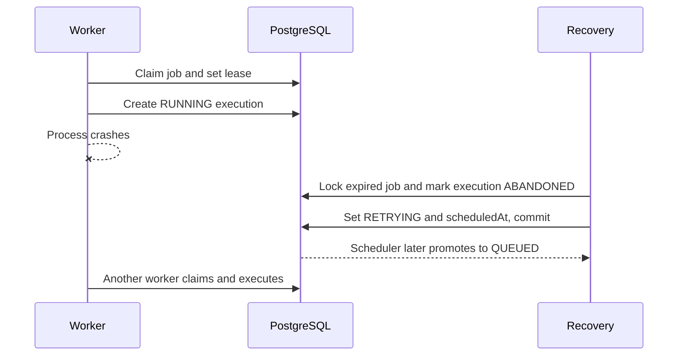

# Reliability and Recovery

Phase 7 keeps PostgreSQL as the source of truth and preserves at-least-once execution. Side-effecting jobs should be idempotent; exactly-once execution is not claimed.

## Retry policy

Concrete jobs snapshot retry strategy and delays when created, so later queue edits do not silently change historical behavior. For one-based failed attempt `n`, delays are:

- FIXED: `initialDelayMs`
- LINEAR: `initialDelayMs * n`
- EXPONENTIAL: `initialDelayMs * 2^(n - 1)`

Delays are clamped to `maxDelayMs` and protected from unsafe integer growth. Optional jitter adds a bounded random value from zero through `jitterMs`; tests use zero jitter. Retryable failures become `RETRYING` with a future `scheduledAt`; the scheduler later promotes them to `QUEUED`. No worker sleeps during backoff.

Executors classify failures with `retryable`. Temporary upstream failures may retry; invalid payloads and configuration errors should be non-retryable. When attempts are exhausted, or a failure is non-retryable, the same logical job remains terminal and one `DeadLetterJob` is created transactionally with the final execution reference.

## DLQ

DLQ APIs are tenant-scoped through queue, project, and organization membership. Operators with OWNER or ADMIN project access may explicitly retry a DLQ record. Manual retry marks `retriedAt`, preserves executions, and returns the existing job to `QUEUED`; it never creates another logical job or executes inside the HTTP request.

## Crash recovery

A job with an expired lease in `CLAIMED` or `RUNNING` is recovered by a bounded worker recovery service. The service takes a transaction-scoped PostgreSQL advisory lock, rechecks the lease and state, marks the running execution `ABANDONED`, clears ownership, and atomically schedules `RETRYING` or creates the DLQ entry. Completed jobs are never recovered. A late heartbeat alone does not make a worker dead.

All recovery and failure transitions are short transactions. Advisory locks and conditional state predicates prevent two retry/recovery processors from applying the same transition. Metrics hooks expose retry, DLQ, abandonment, recovery, delay, and recovery-latency counters for later Prometheus integration.
