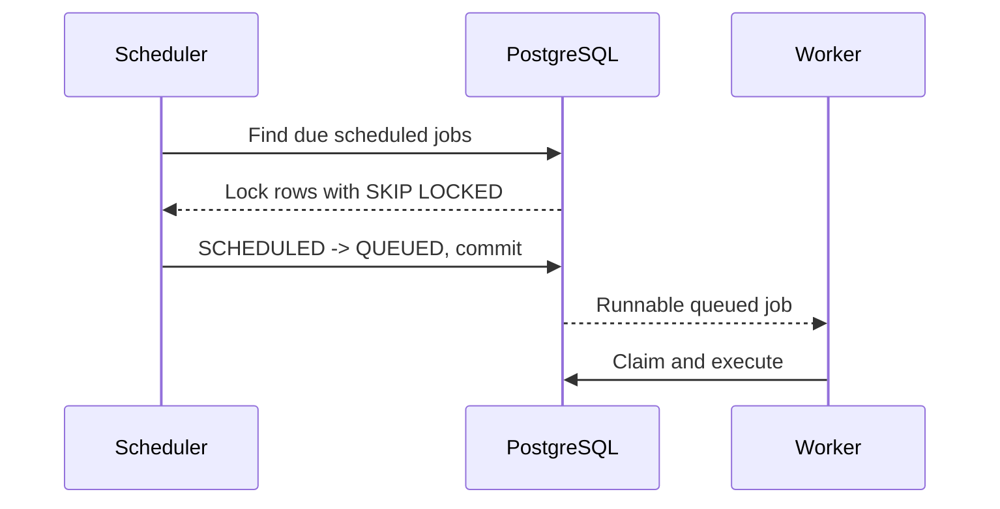

# Scheduler Engine

Phase 6 decides when scheduled work becomes runnable. PostgreSQL remains the authoritative source
of scheduling state; Redis and Kafka are not used for correctness or coordination.

## Scheduling Flow

Concrete delayed and one-time scheduled jobs are stored in `Job` with `status = SCHEDULED` and a
future `scheduledAt`. The scheduler scans bounded batches using the existing `(status,
scheduledAt)` index and promotes due rows to `QUEUED` in a short transaction. Queue pause does not
block this transition: the worker, not the scheduler, decides whether a queued job may execute.
Archived queues are excluded from promotion.

## Recurring Cron

`ScheduledJob` is one recurring definition, not a collection of future executions. CRON definitions
store their expression, IANA timezone, payload, queue, and `nextRunAt`. When due, the scheduler
locks the definition, creates one concrete `Job` with `type = CRON`, `status = QUEUED`, the queue's
current priority and retry limit, and `scheduledAt` equal to the occurrence. Execution history is
created later by the worker.

The next occurrence is calculated with `cron-parser` using the stored timezone and must be strictly
after the processed occurrence. If the scheduler was offline, it creates the single missed
occurrence and advances directly to the next future occurrence; it does not replay every missed
interval. Disabled definitions are skipped and are not repeatedly advanced.

## Duplicate Prevention

Two scheduler instances may select the same due definition, but `processRecurringSchedule` first
takes a PostgreSQL transaction-scoped advisory lock keyed by the `ScheduledJob` ID. It then reads
the current row, conditionally advances `lastRunAt` and `nextRunAt`, and creates the concrete job
in the same transaction. A waiting scheduler observes the already-advanced time and creates no
second occurrence. The concrete job also receives a deterministic idempotency key of
`scheduledJobId:occurrenceTimestamp`, backed by the existing queue-scoped job uniqueness constraint.

Delayed promotion uses `FOR UPDATE SKIP LOCKED` and a conditional `UPDATE` in one transaction, so
multiple schedulers skip locked rows rather than contending or applying an unrelated update.
Transactions are never held open during worker execution or external work.

## Health and Lifecycle

Each process is registered in the `schedulers` table by its unique `schedulerIdentifier`. Startup
records `ACTIVE` and starts polling and periodic heartbeats. Shutdown stops new ticks, marks the
row `DRAINING`, waits for any current database transaction to finish, stops heartbeats, and marks
the row `STOPPED`. `SCHEDULER_SHUTDOWN_TIMEOUT_MS` bounds the drain wait.

The scheduler logs structured events including `scheduler.started`, `scheduler.tick`,
`scheduler.heartbeat`, `scheduler.draining`, `scheduler.stopped`, and `scheduler.error` without
logging payload contents.

## Separation and Delivery Semantics

The scheduler only transitions time-eligible work to `QUEUED`; it never claims or executes jobs.
The worker owns execution and queue eligibility at claim time. The overall system remains
at-least-once: a process failure around a transaction or later execution can require recovery and
application-level idempotency. Exactly-once execution is not claimed.

Automatic retry scheduling, expired-lease recovery, DLQ processing, Kafka dispatch, Redis
coordination, and workflow dependencies remain deferred.
